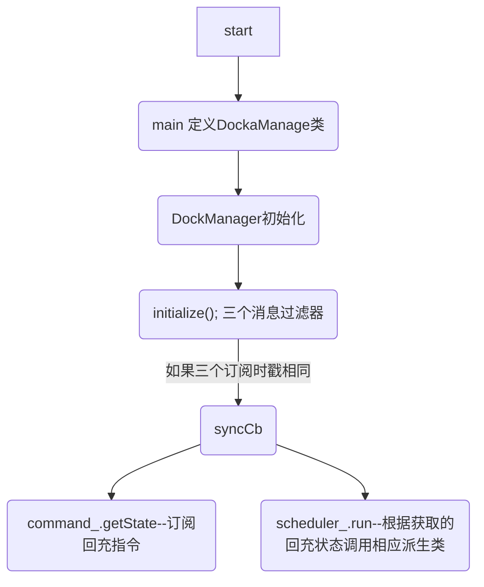
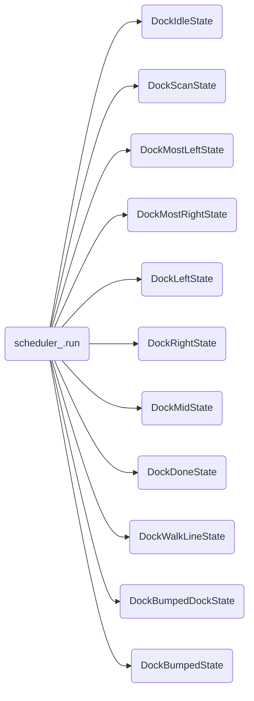

# 回充指令

## 订阅回充指令 Topic

**dock_command.cpp**

---

订阅发布的回充指令。回调在下面几行。注意到它是 DockCommand 类的构造函数。

```c++
/**
 *  订阅回充指令对应话题 /puppy_auto_docking
 *  --所属类: DockCommand
 */
DockCommand::DockCommand()
{
    ROS_INFO("DockCommand::DockCommand");

    std::string auto_docking_topic  = "/puppy_auto_docking";
    //订阅其它节点发布的回充开始指令. Topic: puppy_auto_docking
    auto_docking_sub_ = nh_.subscribe<puppy_msgs::DockCMD>(auto_docking_topic, 1, boost::bind( &DockCommand::commandCallback, this, _1 ));
}
```

下面查看 auto_docking_sub_ 的定义


**dock_command.h**

---

```c++
class DockCommand
{
public:


    DockCommand();
    ~DockCommand(){}

    Command getState();
    void commandCallback(const puppy_msgs::DockCMDConstPtr& cmd);

private:
    ros::NodeHandle       nh_;
    //Command调用
    Command               state_;
    //Command定义
    ros::Subscriber       auto_docking_sub_;
};
```

下面查看 DockCommand 方法的定义


**dock_manager.h**

---

```c++
/**
 *  回充管理
 * 
 */
class DockManager
{
public:
    DockManager();
    void initialize();
    void run();
    void pubishDockPose();
...

private:
...

    boost::thread* run_thread_;
    DockCommand    command_;
```

如上，在DockManager 类中定义了一个 DockCommand 的私有类变量，下面看变量 command_ 的调用


**dock_manager.cpp**

---

```c++
/**
 *  同步Cb, 如果没发生<碰撞>/<充电>事件, 读取底盘红外信号, 并判断回充状态
 */
void DockManager::syncCb(const nav_msgs::OdometryConstPtr &odom,
                         const kobuki_msgs::SensorStateConstPtr &core,
                         const kobuki_msgs::DockInfraRedConstPtr &ir)
{
    std::vector<unsigned char> signal_filt(ir->data.size(), 0);

    if(core->bumper || core->charger)
    {
        monitorEvecnt(core->bumper, core->charger);
    }
    else
    {
        filterIRSensor(signal_filt, ir->data);
        //调用 command_.getState 方法
        if (command_.getState())
        {
            if (scheduler_.getState() == RobotDockingState::DOCKED_IN ||
                scheduler_.getState() ==  RobotDockingState::DONE)
            {
```


getState 方法定义如下：

```c++
/**
 *  获取回充指令
 *  --所属类: DockCommand
 */
Command DockCommand::getState()
{
    return state_;
}
```

注意到 state_ 定义为回充指令，所以上述 getState 其实是获取的回充指令状态。<span style='color:red'>此处注意与回充状态区分</span>

但是这个地方并不是在循环调用 command_ 以订阅指令。所以看下 syncCb 是不是一直在调用。


## syncCb调用方式

**dock_manager.cpp**

---

```c++

/**
 *  初始化
 * 
 */
void DockManager::initialize()
{
    // Initialize topic messages.
    std::string odom_topic          = "/odom";
    std::string ir_topic            = "/mobile_base/sensors/dock_ir";
    std::string core_topic          = "/mobile_base/sensors/core";

    // message filter sync odm topic and ir topic.
    // odom_sub_订阅odom_topic话题, 队列缓存100个, 下面两个类推
    odom_sub_.reset(new message_filters::Subscriber<nav_msgs::Odometry>(nh_,       odom_topic, 100));
    core_sub_.reset(new message_filters::Subscriber<kobuki_msgs::SensorState>(nh_, core_topic, 100));
    ir_sub_.reset(new message_filters::Subscriber<kobuki_msgs::DockInfraRed>(nh_,  ir_topic,   100));
    
    // 在odom_sub_, core_sub_, ir_sub_这三个订阅接收到的数据有相同时戳的时候, 执行下面的回调函数
    sync_.reset(new message_filters::Synchronizer<SyncPolicy>(SyncPolicy(100), *odom_sub_, *core_sub_, *ir_sub_));
    // sync_的回调
    sync_->registerCallback(boost::bind(&DockManager::syncCb, this, _1, _2, _3));
    
    ...
}
```

搜索工程，可以看到是在 DockManager 类的初始化方法中有调用(<span style='color:red'>只有</span>这个地方在调)。

---

综上，它不是循环调用对指令的订阅来接收回充指令的。它用了ROS的一个 **message_filters** 的功能.

即odom(里程)、core(SensorState)、ir_topic(红外信号)这三个订阅接收到的数据有相同时戳的时候，才会去回调函数里调用syncCb，才会执行到订阅回调指令处。


# 回充框架

桩上有4+1个红外发射器，对应的信号区域有5个(不包括重叠部分)，机器人对应位于不同的信号区域内相应要有不同的动作。

## 机器人回充状态

首先有一个机器人回充状态的类: **RobotDockingState**, 它只有一个枚举成员：

```c++
/**
 *  表示机器人回充状态
 *  --成员只有一个枚举
 */
struct RobotDockingState
{
    //机器人回充状态枚举
    enum State {
        IDLE,       // idle
        DONE,       // done
        DOCKED_IN,  // docked station
        BUMPED_DOCK,// bumped dock
        BUMPED,     // bumped
        SCAN,       // scan
        ALIGNED,    // aligned
        MLEFT,      // most left
        MRIGHT,     // most right
        LEFT,       // left
        RIGHT,      // right
        WLINE,      // walk line
        FIND_STREAM,
        UNKNOWN,    // unkown
        LOST        // lost
    };
};
```

可以看到枚举中定义了15种回充状态。


## 回充调度

回充调度类 **Scheduler**

成员.run			-> 运行

成员.setSate 	-> 设置当前回充状态

成员.getState	-> 返回当前回充状态

---

### run的实现

```c++
/**
 *  run处理, 即开始运行回充
 *  --所属类: Scheduler
 */
void Scheduler::run(RobotDockingState::State& new_state,
                    const nav_msgs::OdometryConstPtr& odom,
                    const std::vector<unsigned char> &signal,
                    const kobuki_msgs::SensorStateConstPtr &core)
{
    container_[state_]->handleMsgAndVelocity(new_state, odom, signal, core);
    state_ = new_state;
}
```

可以看到 run 方法中出现了 ``container_[state_]``，state_参数为上面枚举所在的类，即回充状态。

container_ 在 Scheduler类中定义如下：

```c++
...
private:
    RobotDockingState::State state_;
    std::map<RobotDockingState::State, BaseDockState*>  container_;
};
```

可以看到这是一个关联容器，可以想到，这个容器是和回充状态相关的。

看下 Scheduler 类的构造函数：


```c++
Scheduler::Scheduler() :
    state_(RobotDockingState::IDLE)
{
    // Add dock object.d
    container_.insert(std::make_pair<RobotDockingState::State, BaseDockState*>(RobotDockingState::IDLE,   new Dock::DockIdleState()));
    container_.insert(std::make_pair<RobotDockingState::State, BaseDockState*>(RobotDockingState::SCAN,   new Dock::DockScanState()));
    container_.insert(std::make_pair<RobotDockingState::State, BaseDockState*>(RobotDockingState::MLEFT,  new Dock::DockMostLeftState()));
        ...
 }
```

DockIdleState、DockScanState 均为对应不同回充状态的类，这些类中有对应设置速度和角速度的方法。


可以看到，这些类都是派生类，基类为 BaseDockState。


### run 调用


回充指令调用可以看到 syncCb 的调用方式。

在这个函数里，如果判断没\<发生碰撞\>或\<正在充电\>, 会先读取红外信号(filterIRSensor)，然后读取当前的回充状态(command_.getState())，如果不是正在回充或回充完成，set回充状态为SCAN，然后调用run.


## 框架概述

由上可知，回充的框架大概如下：

---

### mian

**puppy_docking_node.cpp**


main中什么也没做，定义了一个 DockaManager 类就在循环等。

---

### DockManager

执行构造函数初始化类。

DockManager();


起了一个线程后执行初始化方法 initialize();

---


定义了针对 odom_topic、ir_topic、core_topic三个话题的消息过滤器。

这三个订阅接收到的数据有相同时戳时进入回调函数 syncCb.

---

### syncCb函数

1. 调用了 command_.getState 方法，**command\_ **为 **DockCommand** 类，它的构造函数中订阅了回充指令。
2. 调用了 scheduler_.run 方法，**scheduler\_ **为 **Scheduler** 类，它定义了一个关联容器将不同回充状态与对应状态的类联系起来，syncCb 调用run方法时先获取了回充状态，再调用这个容器，执行对应的速度设置。


如果订阅的话题一直满足时戳要求，就不断调用 syncCb 函数，不断调整速度和回充状态，直到回充完成。

---

### 流程图






---


ecl**::LegacyPose2D


